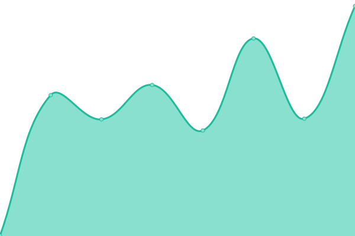
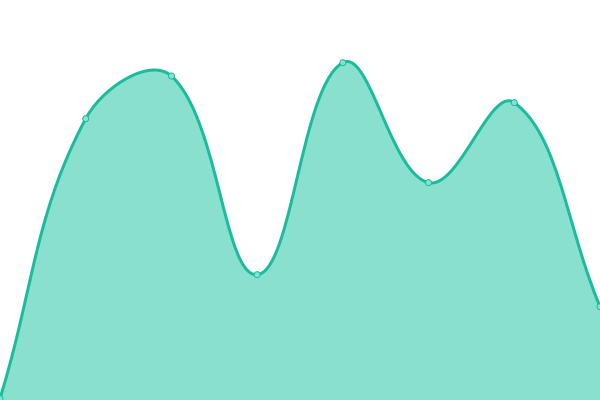

# [📈 Live Status](https://dashpan.github.io/dashpan-status): <!--live status--> **🟩 All systems operational**

This repository contains the open-source uptime monitor and status page for [Dashpan](https://dash.agenciapan.com/), powered by [Upptime](https://github.com/upptime/upptime).

With [Upptime](https://upptime.js.org), you can get your own unlimited and free uptime monitor and status page, powered entirely by a GitHub repository. We use [Issues](https://github.com/dashpan/dashpan-status/issues) as incident reports, [Actions](https://github.com/dashpan/dashpan-status/actions) as uptime monitors, and [Pages](https://dashpan.github.io/dashpan-status) for the status page.

<!--start: status pages-->
<!-- This summary is generated by Upptime (https://github.com/upptime/upptime) -->
<!-- Do not edit this manually, your changes will be overwritten -->
<!-- prettier-ignore -->
| URL | Status | History | Response Time | Uptime |
| --- | ------ | ------- | ------------- | ------ |
|  [API (Produção)](https://api-dash.agenciapan.com) | 🟩 Up | [api-producao.yml](https://github.com/dashpan/dashpan.github.io/commits/HEAD/history/api-producao.yml) | 

 549ms
     
 | 

<a href="https://dashpan.github.io/dashpan-status/history/api-producao">100.00%</a>
    

|  [API (Homologação)](https://api-dashteste.agenciapan.com) | 🟩 Up | [api-homologacao.yml](https://github.com/dashpan/dashpan.github.io/commits/HEAD/history/api-homologacao.yml) | 

 398ms
     
 | 

<a href="https://dashpan.github.io/dashpan-status/history/api-homologacao">100.00%</a>
    

|  [API (MAHAV)](https://api-mahav.dashpan.com) | 🟩 Up | [api-mahav.yml](https://github.com/dashpan/dashpan.github.io/commits/HEAD/history/api-mahav.yml) | 

 758ms
     
 | 

<a href="https://dashpan.github.io/dashpan-status/history/api-mahav">100.00%</a>
    

|  [API (PowerBee)](https://api-powerbee.dashpan.com) | 🟩 Up | [api-power-bee.yml](https://github.com/dashpan/dashpan.github.io/commits/HEAD/history/api-power-bee.yml) | 

 686ms
     
 | 

<a href="https://dashpan.github.io/dashpan-status/history/api-power-bee">100.00%</a>
    

|  [App (Produção)](https://dash.agenciapan.com) | 🟩 Up | [app-producao.yml](https://github.com/dashpan/dashpan.github.io/commits/HEAD/history/app-producao.yml) | 

 243ms
     
 | 

<a href="https://dashpan.github.io/dashpan-status/history/app-producao">100.00%</a>
    

|  [App (Homologação)](https://dashteste.agenciapan.com) | 🟩 Up | [app-homologacao.yml](https://github.com/dashpan/dashpan.github.io/commits/HEAD/history/app-homologacao.yml) | 

 223ms
     
 | 

<a href="https://dashpan.github.io/dashpan-status/history/app-homologacao">100.00%</a>
    

|  [App (MAHAV)](https://mahav.dashpan.com) | 🟩 Up | [app-mahav.yml](https://github.com/dashpan/dashpan.github.io/commits/HEAD/history/app-mahav.yml) | 

 437ms
     
 | 

<a href="https://dashpan.github.io/dashpan-status/history/app-mahav">100.00%</a>
    

|  [App (Powerbee)](https://powerbee.dashpan.com) | 🟩 Up | [app-powerbee.yml](https://github.com/dashpan/dashpan.github.io/commits/HEAD/history/app-powerbee.yml) | 

 210ms
     
 | 

<a href="https://dashpan.github.io/dashpan-status/history/app-powerbee">100.00%</a>
    

<!--end: status pages-->

[**Visit our status website →**](https://dashpan.github.io/dashpan-status)

## 📄 License

- Powered by: [Upptime](https://github.com/upptime/upptime)
- Code: [MIT](./LICENSE) © [Dashpan](https://dash.agenciapan.com/)
- Data in the `./history` directory: [Open Database License](https://opendatacommons.org/licenses/odbl/1-0/)
